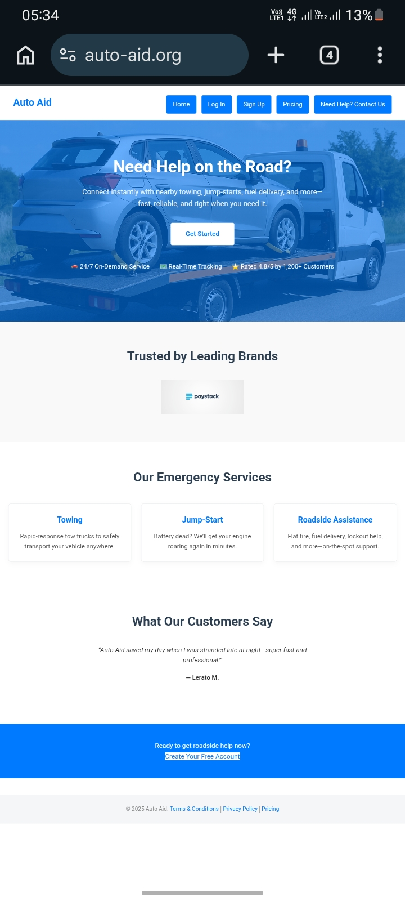
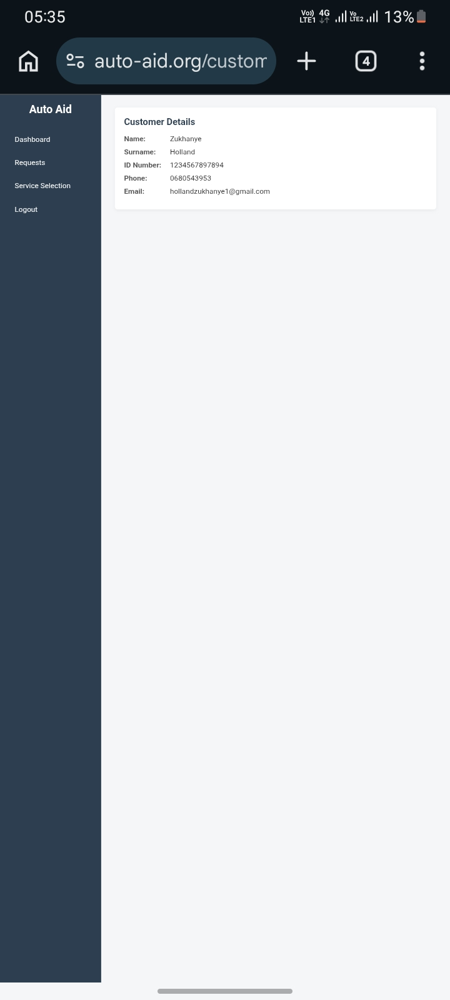
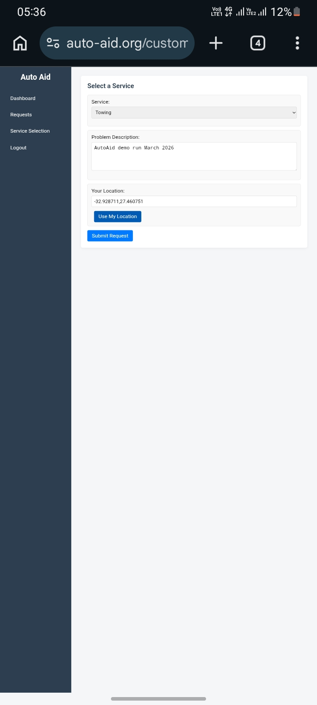

AutoAid

AutoAid is a web platform that connects drivers with roadside assistance services.

Features
- Roadside assistance request system
- Customer dashboard
- Request tracking
- Mobile responsive design
- Firebase integration

Tech Stack
- HTML
- CSS
- JavaScript
- Firebase

Live Demo:
https://zukhanyeholland.github.io/autoaid/

Screenshots

## Screenshots

Author
Zukhanye Holland
